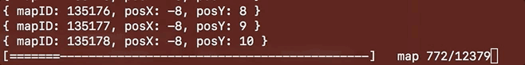

# Dofus-Discovery
A tool to generate an overview of the Dofus world map and create a pathfinder algorithm

# Done

 - Collecting all Map IDs
 - Collecting Maps Positions

# To Do

 - Save maps to DB
 - Implement algorithm to check if can cross a map
 - Implement A* algorithm
