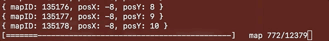
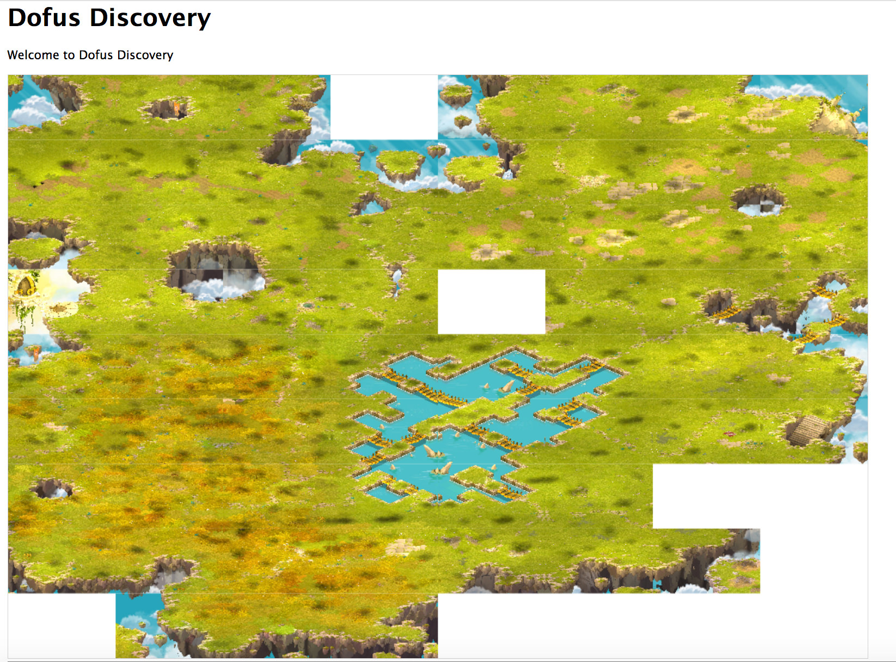

# Dofus-Discovery
A tool to generate an overview of the Dofus world map and create a pathfinder algorithm

# Done

 - Collecting all Map IDs
 - Collecting Maps Positions
 - Downloading full size background
 - Resizing a smaller background
 - Render Starter Area and Amakna Area

# To Do

 - Render from downloaded files (should make render much faster!)
 - Implement algorithm to check if can cross a map
 - Implement A* algorithm

# Contact Me

Email: mederic.burlet@gmail.com

Discord: https://discord.gg/2DeDe2Q
